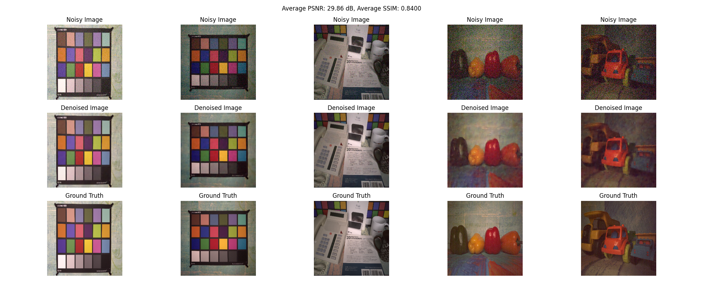

# Denoising Autoencoder

This is an implementation of a Denoising Autoencoder (DAE) using PyTorch.
It learnt to remove ISO noise of images from the [Smartphone Image Denoising Dataset](https://www.kaggle.com/datasets/rajat95gupta/smartphone-image-denoising-dataset) used in the NTIRE 2019 Real Image Denoising Challenge.
The architecture of the DAE is based on the [winner](https://openaccess.thecvf.com/content_CVPRW_2019/papers/NTIRE/Abdelhamed_NTIRE_2019_Challenge_on_Real_Image_Denoising_Methods_and_Results_CVPRW_2019_paper.pdf) of this competition.

